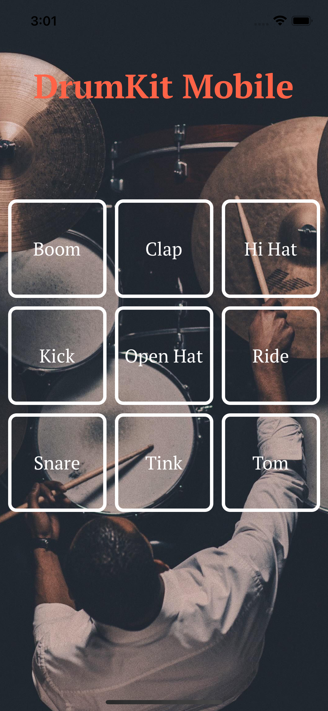

# DrumKitMobile



DrumKitMobile is a mobile application that allows users to play virtual drums on their devices. It's developed using the Expo platform and provides an interactive drumming experience.

## Getting Started

Follow these instructions to set up the project on your local development environment and start drumming!

### Prerequisites

- [Node.js](https://nodejs.org/) - Make sure Node.js is installed to run and develop the app.
- [Expo CLI](https://docs.expo.dev/workflow/expo-cli/) - Install the Expo CLI globally using the following command if you haven't already:

  ```bash
  npm install -g expo-cli
  ```

### Installation

1. Clone the DrumKitMobile project:

   ```bash
   git clone https://github.com/ugurde98/DrumKitMobile.git
   ```

2. Navigate to the project directory:

   ```bash
   cd DrumKitMobile
   ```

3. Install the required packages:

   ```bash
   npm install
   ```

4. Start the app:

   ```bash
   expo start
   ```

5. Scan the QR code with the Expo Go app on your mobile device or use an emulator to run the app.

## Usage

Open the DrumKitMobile app and tap on the drum elements to play sounds. Enjoy creating rhythms and beats!

## Development

Start editing the project to enhance the drumming experience. The Expo development server will automatically update the app as you make changes.


## License

DrumKitMobile is licensed under the [MIT License](LICENSE). See the [LICENSE](LICENSE) file for more details.

---

Developer: [ugurde98](https://github.com/ugurde98)

Project Link: [https://github.com/ugurde98/DrumKitMobile](https://github.com/ugurde98/DrumKitMobile)
```

